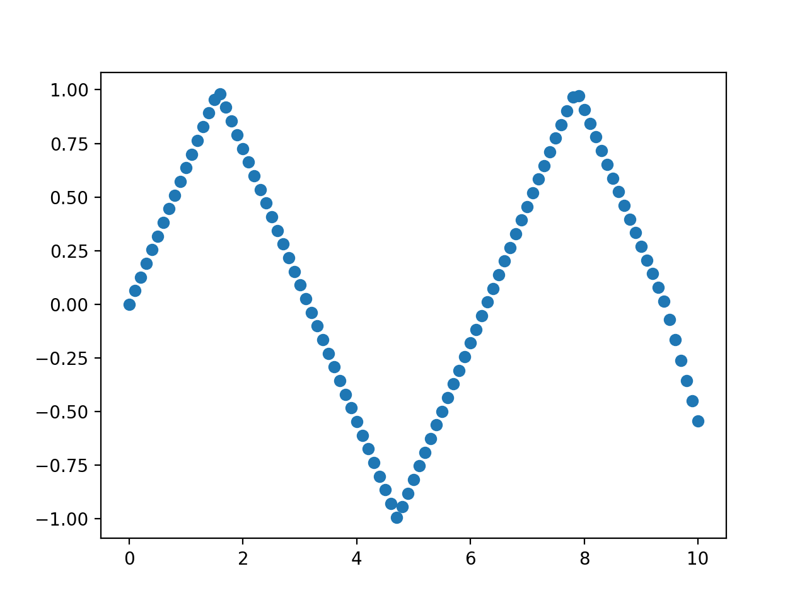
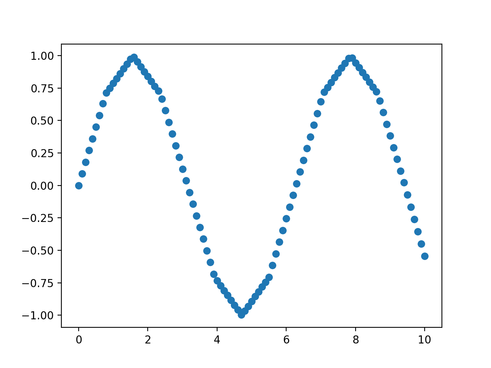
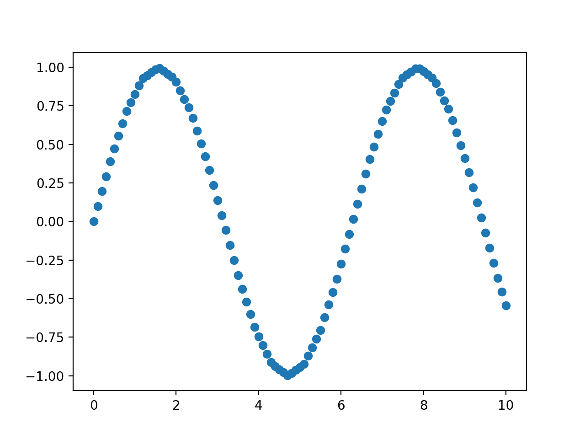
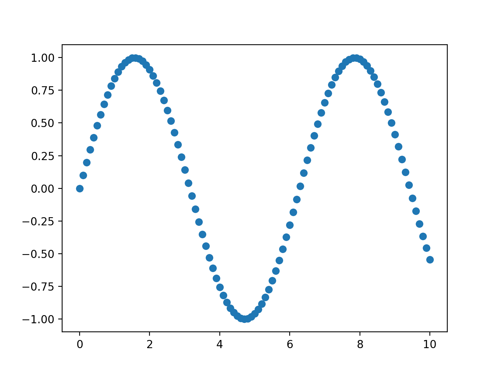
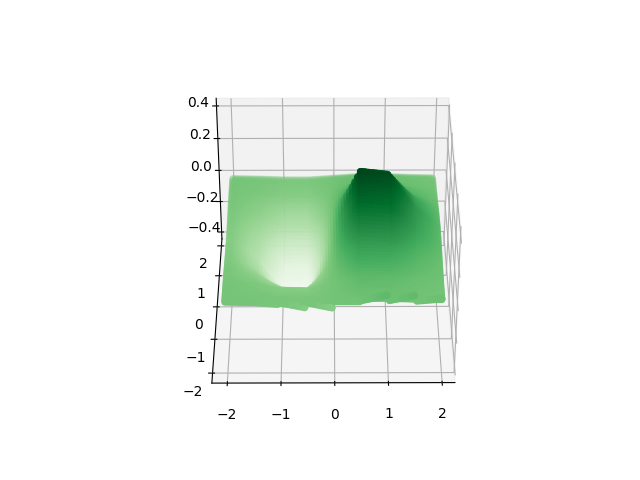
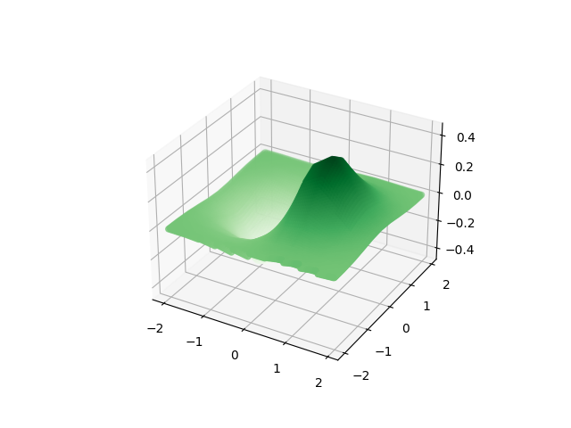
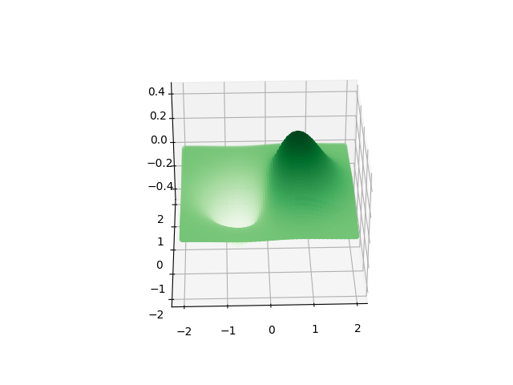
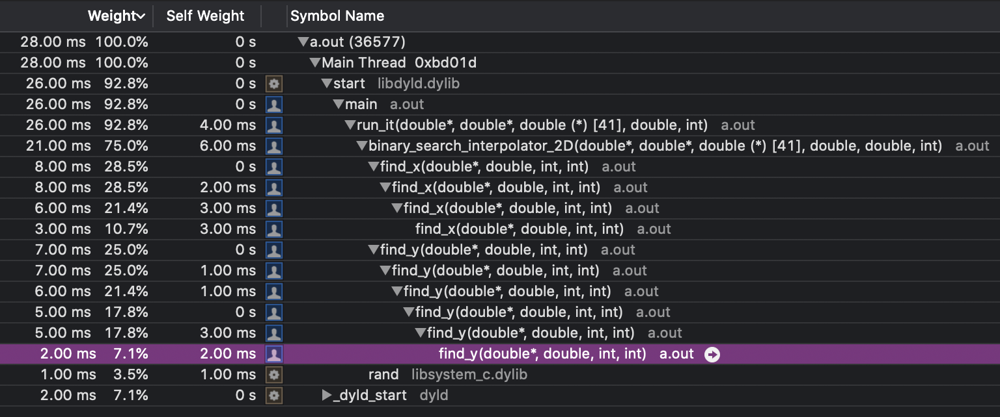
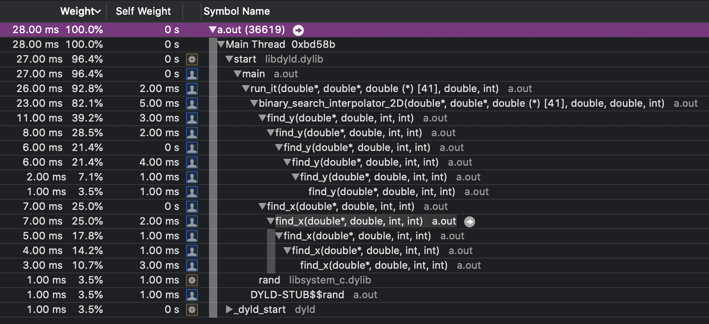

The task is as follows:-
1. Write a function or class in C++ to perform 1D linear interpolation in x, given a list of x points and function values f(x).
   Test it on the function sin(x) in x = [0,10], with appropriate sampling of the x points, and plot.

2. Using this function or otherwise, create a 2D linear interpolator (x,y) -> f(x,y).
   Test it on the function x exp(-x^2-y^2) in the range x = [-2,2], y = [-2,2] with appropriate sampling, and plot.

    2b. [Optional] Convert your interpolator to use a cubic spline interpolation, and re-plot. What is the effect?

3. Profile your code performance over O(10^5) randomly chosen x,y values. Where
   is most CPU being spent, and how could you make it more efficient?

**This readme contains my thoughts when i was thinking of solutions to these problems**

## Problem 1

We have a list of points `x` and their respective `f(x)`. We are to find an approximate value of `f(c)` for some given `c`. This is a simple problem, we have to find the value `x` in the list that equals `c`, and if such a point does not exist, we find the two closest xs (let us call them x1 and x2) in the list such that `x1< c` and `x2>c`. If two such points do not exist, that is, c is outside the range of the list, we simply cannot give a good approximation for f(c).

This can be achieved in multiple ways. The first way that came to my mind was simply interating through the list one by one and finding the apprpiate x1 and x2. But obviously this is a very time consuming method.

The second method that comes to mind in binary search, which is much better and is what has been implemented. I implemented non-threaded binary search, because when the list size is of the order of 10^5, creating threads takes more time than the time saved by threading. (I "learnt" this from another project I did, do correct me if I'm wrong/over-generalising).

After creating the binary search function, i tested it on some edge cases, to make sure it works, and then went on to plotting for the sin function.

Then I created python scripts to help plot my results on the sin function in the interval [0,10]. `./problem1/generate_sin.py` generates an array that contains the values of the sin function that i will use to determine other values. Then `./problem1/1D_linear_interpolator.cpp` uses the function `generating_csv_for_plot` to generate a csv that contains the points that are to plotted. These points are the x value, and the f(x) determined through linear interpolation. The csv's that have been generated are all in `./problem1/csc_files`. Then `./problem1/plot.py` reads the csv and gives you the plots. The plots are all in `./problem1/plots`. As you can see, as the interval between points taken for the initial array(the array based off which we estimate values) decreases, the plots seem to become more close to the actual sin function. This is also shown by seeing the valuues of the MSE. They are shown in `./problem1/MSE.txt` and were generated by `./problem1/generate_MSE.py`

**the graphs are shown below**
### When the points differ by pi/2


### When the points differ by pi/4


### When the points differ by pi/8


### When the points differ by pi/16


### When the points differ by pi/32


### MSE
```
MSE for pi/2 is 0.021246053007044498
MSE for pi/4 is 0.001444201748400315
MSE for pi/8 is 9.219112667292716e-05
MSE for pi/16 is 5.868160983538648e-06
MSE for pi/32 is 4.0992849516855613e-07
```

## Problem 2
This was very similar to the first problem. In the first problem you needed t find the two indexs closest to the value of x you wanted. Here you have to the exact same thing, but for two values, your x and your y value. Depending on the indexes you get, you use a formula to approximate your functions value.

After creating the code to execute bilinear interpolation, i did almost the same thing as i did in the first problem, plotting graphs i got when i took datasets of different sizes, and also found MSEs. As you can see in `./problem2/MSE.txt`, when the data i take has values with smaller intervals between them, the total MSE decreases. When the interval was 0.5, then the MSE was of the order of 10^-4, but when the interval was 0.1, the MSE was of the order 10^-6.


The graphs are shown below

### When the points differ by 0.5


### When the points differ by 0.4


### When the points differ by 0.2


### When the points differ by 0.1


### MSE
```
MSE for interval 0.1 is 3.3007056728861102e-06
MSE for interval 0.2 is 7.230871762727755e-06
MSE for interval 0.4 is 0.00011154828724936548
MSE for interval 0.5 is 0.00026221180257825574
```
## Problem 3

Here, I used the Instruments application in mac to see the amount of time and weight of the different parts of the code. The code that was run was `./problem3/code.cpp`, which generates 10^5 random x and y values, and does 2D linear interpolation on a set of points for the function `x*e^(-x^2 - y^2)`, where the difference between the x values of consective points is 0.1.

From what i can see, the program spends quite some time in the last itterations of the binary search. One way to improve that might be to wait for the difference betweent top and bottom points being considered becomes a small value like 5, and then to simply itterate through these 5 values to get the required index. This would save time as an addition call to the stack would be avoided.

These are the images that give the profile of the program.


